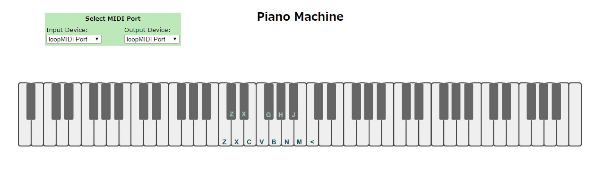
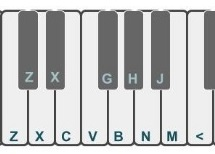

# PianoMachine
- These programs use Web Audio API and Web MIDI API
- You can play to acsess as below. https://mikatahara.github.io/PianoMachine/ 
- When you open this page you have following view. 

 

 

- However you can't get this view, please reloard thie page. 
 
- Piano Play Mode
 

 
- By pushing keyboard 'Z', 'X', ..., you can get piano sound. 
 

 
- By pushing numeric keyboard, you can select octave. 
-- "3" - 2oct down 
-- "4" - 1oct down 
-- "5" - center 
-- "6" - 1oct up 
-- "7" - 2oct up 
-- "8" - 3oct up 
 
 
- Chrod Mode

 
- If you have a midi keyboard, plsease select Input MIDI Device. 
- Hit a key on the midi keyboard as bellow, you can get piano sound. 

